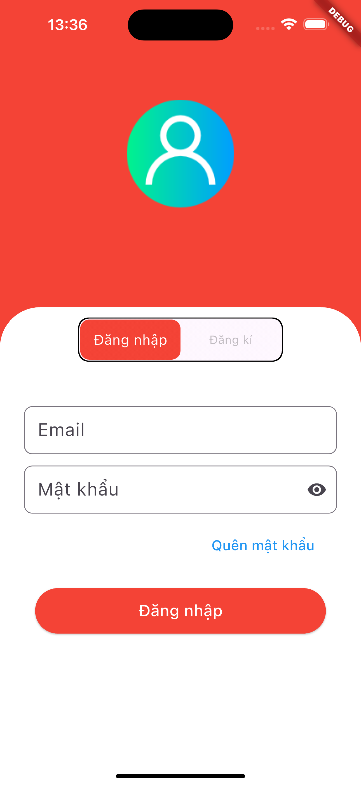
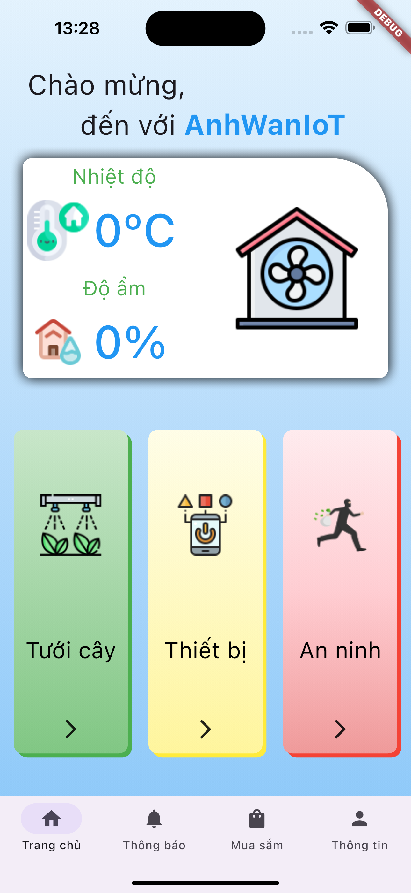

# 🦋 Smart Home Flutter App

Ứng dụng Flutter quản lý nhà thông minh kết nối với **Firebase** và **ESP32** qua Internet.
Người dùng có thể **điều khiển thiết bị, theo dõi cảm biến, và nhận thông báo theo thời gian thực**.

---

## 📑 Mục lục

1. [Giới thiệu](#-giới-thiệu)
2. [Ảnh minh họa](#-ảnh-minh-họa)
3. [Tính năng](#-tính-năng)
4. [Kiến trúc dự án](#-kiến-trúc-dự-án)
5. [Công nghệ sử dụng](#-công-nghệ-sử-dụng)
6. [Cài đặt & Chạy thử](#-cài-đặt--chạy-thử)
7. [Cấu trúc thư mục](#-cấu-trúc-thư-mục)
8. [Hướng phát triển](#-hướng-phát-triển)
9. [Tác giả](#-tác-giả)

---

## 🚀 Giới thiệu

**Smart Home App** là một ứng dụng Flutter cho phép:

* Điều khiển thiết bị điện (bật/tắt đèn, quạt…)
* Theo dõi dữ liệu cảm biến (nhiệt độ, độ ẩm, gas…)
* Đồng bộ trạng thái thời gian thực với Firestore và ESP32
* Gửi thông báo (Firebase Cloud Messaging)

---

## 🖼 Ảnh minh họa

| Màn hình Đăng nhập                 | Màn hình Chính                   | 
| ---------------------------------- | -------------------------------- | 
|   |   | 

---

## 💡 Tính năng

* 🔐 Đăng ký / Đăng nhập bằng Email & Password
* 🧠 Clean Architecture + BLoC Pattern
* ☁️ Lưu dữ liệu thời gian thực bằng **Firebase Firestore**
* 📩 Nhận thông báo bằng **Firebase Cloud Messaging**
* 🧱 Quản lý quyền người dùng (Admin / User)

---

## 🧭 Kiến trúc dự án

Ứng dụng áp dụng mô hình **Clean Architecture**:

* `data/` – Firebase repository, API, models
* `domain/` – business logic, entities, use cases
* `presentation/` – UI và BLoC quản lý state

> Dưới đây là sơ đồ kiến trúc minh họa:

```
Flutter UI → BLoC → UseCase → Repository → Firebase
```

---

## 🛠 Công nghệ sử dụng

* **Flutter**
* **Dart**
* **Firebase Auth / Firestore / FCM**
* **BLoC + Equatable**
* **Clean Architecture**

---

## ⚙️ Cài đặt & Chạy thử

### 1️⃣ Clone repository:

```bash
git clone https://github.com/pkaquan/project_flutter.git
cd smart_home_flutter
```

### 2️⃣ Cài dependencies:

```bash
flutter pub get
```

### 3️⃣ Cấu hình Firebase:

* Tạo project trên [Firebase Console](https://console.firebase.google.com/)
* Tải file `google-services.json` (Android) và `GoogleService-Info.plist` (iOS)
* Thêm vào thư mục tương ứng trong project

### 4️⃣ Chạy ứng dụng:

```bash
flutter run
```

---

## 🗂 Cấu trúc thư mục

```
lib/
 ┣ core/
 ┃ ┣ utils/
 ┃ ┣ constants/
 ┣ core/
 ┃ ┣ utils/
 ┃ ┣ constants/
 ┣feature
 ┃ ┣ auth/
 ┃ ┃ ┣ data/
 ┃ ┃ ┃ ┣ datasource/
 ┃ ┃ ┃ ┣ models/
 ┃ ┃ ┃ ┣ repositories/
 ┃ ┃ ┣ domain/
 ┃ ┃ ┃ ┣ repositories/
 ┃ ┃ ┃ ┣ entities/
 ┃ ┃ ┃ ┣ usecases/
 ┃ ┃ ┣ presentation/
 ┃ ┃ ┃ ┣ blocs/
 ┃ ┃ ┃ ┣ controller/
 ┃ ┃ ┃ ┣ screens/
 ┃ ┃ ┃ ┣ widgets/
 ┃ ┣ dashboard/
 ┃ ┃ ┣ data/
 ┃ ┃ ┃ ┣ datasource/
 ┃ ┃ ┃ ┣ models/
 ┃ ┃ ┃ ┣ repositories/
 ┃ ┃ ┣ domain/
 ┃ ┃ ┃ ┣ repositories/
 ┃ ┃ ┃ ┣ entities/
 ┃ ┃ ┃ ┣ usecases/
 ┃ ┃ ┣ presentation/
 ┃ ┃ ┃ ┣ blocs/
 ┃ ┃ ┃ ┣ screens/
 ┃ ┃ ┃ ┣ widgets/
```

---

## 🔮 Hướng phát triển

* Thêm chế độ điều khiển bằng giọng nói
* Hỗ trợ nhiều thiết bị cùng lúc
* Tự động xử lí hình ảnh bằng AI lấy từ Storage (Firebase)

---

## 👨‍💻 Tác giả

**Phạm Khoa Anh Quân**
📧 Email: [mam4ch333@gmail.com](mailto:mam4ch333@gmail.com)
🔗 [GitHub](https://github.com/pkaquan)
